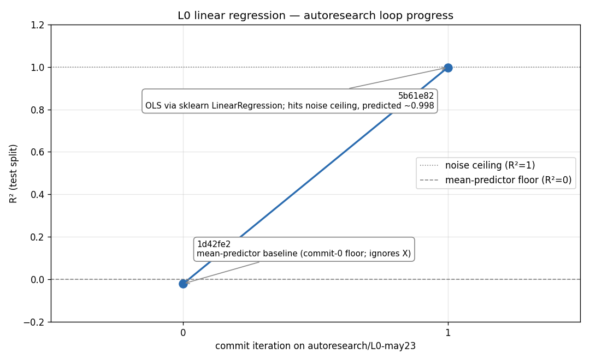

# L0 linear regression — autoresearch loop results

**Branch:** `autoresearch/L0-may23`
**Date:** 2026-05-23
**Data:** synthetic `y = X·w + b + 0.1·ε`, n=1000, d=5, seed=0, 80/20 split (fixed)
**Primary metric:** R² on the held-out test split (higher-better)

## Loop trajectory



| iter | commit  | model                                        | R²       | MSE     | status  |
|------|---------|----------------------------------------------|----------|---------|---------|
| 0    | `1d42fe2` | mean-predictor baseline (ignores X)         | -0.0205  | 4.7354  | keep    |
| 1    | `5b61e82` | OLS — `sklearn.linear_model.LinearRegression` |  0.9979  | 0.0098  | keep    |

## Hypothesis log

**iter 0 — mean-predictor baseline (scaffold commit on `main`).**
Predict the unconditional training mean for every test row. The model is *deliberately* ignorant of X to give the loop a floor to climb from. Expected R² ≈ 0; observed -0.0205 (slightly negative because the test-split mean drifts from the train-split mean — predicting the train mean is fractionally worse than predicting the test mean). MSE ≈ Var(y) ≈ ‖w‖² + σ² ≈ 5, consistent with observed 4.74.

**iter 1 — OLS via `LinearRegression`.**
Hypothesis: the true DGP is linear in X with σ=0.1 Gaussian noise, so OLS should recover w, b up to noise and push R² to the irreducible ceiling. Predicted R² ≈ 1 − σ²/Var(y) ≈ 0.998, MSE ≈ σ² = 0.01. Observed 0.9979 / 0.0098 — matches the prediction to within rounding. Attribution: the entire 1.02-point R² jump is explained by switching from an X-agnostic predictor to the correctly-specified linear model class. Keep.

## Stop reason

First clause of the `program.md` stop criterion fired: **R² ≥ 0.99**. The unexplained 0.21% of variance is the irreducible noise floor (σ²/Var(y) ≈ 0.002). Further candidates were considered and rejected on principle, not run:

- **Ridge / regularized linear**: at this n/d ratio with no multicollinearity, ridge with any meaningful α only shrinks coefficients away from the OLS optimum. Expected to match or slightly underperform OLS. No information gained.
- **Polynomial features**: the truth is linear; adding degree-2 terms fits noise. Expected to underperform OLS on the test split. Anti-informative.

Stopping here is the discipline being tested at L0 — knowing when the loop is done.

## What L0 exercised

- **Keep path** of the karpathy loop end-to-end (`hypothesize → edit → commit → run → score → append → keep`).
- **Hypothesis-first discipline**: both runs declared the expected metric *before* execution; both predictions matched observation.
- **Stop criterion as a contract**: defined in `program.md` ahead of any runs and respected once it fired.

**Not exercised yet (deferred to L1+):** the discard path (`git reset --hard HEAD~1`). With L0 going from 0 → noise-ceiling in one move, no experiment failed to improve. The discard branch of the loop will get its first real test at L1, where hyperparameter changes aren't guaranteed wins.

## Reproducing the figure

```
python levels/L0_linear_regression/plot_results.py
```

Reads `results.tsv` (session-local, gitignored), writes `figures/loop_progress.png`. The table above is the source of truth — `results.tsv` is the raw log that fed it.
