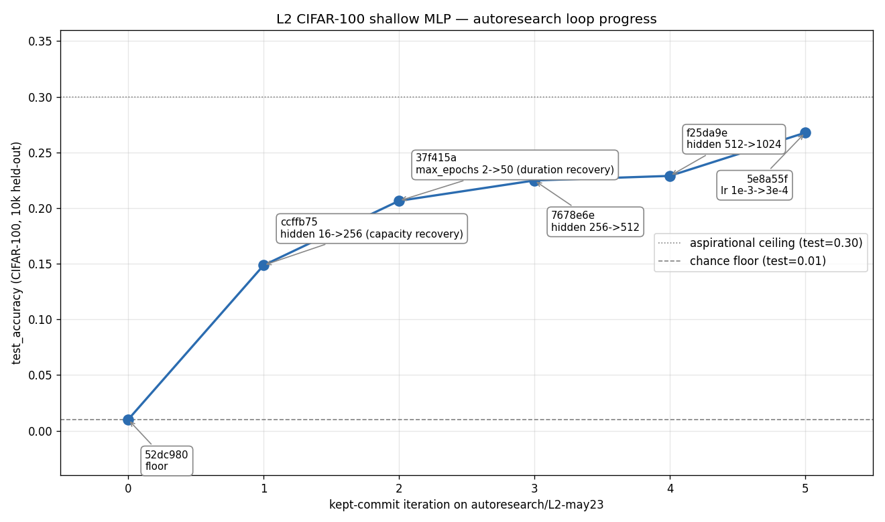

# L2 CIFAR-100 shallow MLP — autoresearch loop results

**Branch:** `autoresearch/L2-may23`
**Date:** 2026-05-24
**Hardware:** NVIDIA A40 (CUDA 12.4), torch 2.6.0+cu124
**Data:** CIFAR-100 via torchvision, 50k/10k train/test, pixels → [0, 1], flattened to 3072-dim (fixed harness)
**Architecture:** 3072 → hidden (ReLU) → 100 logits, Adam optimizer, cross-entropy loss (fixed harness)
**Primary metric:** `test_accuracy` on the 10k held-out test set (higher-better)

## Loop trajectory



## Kept commits

| iter | commit  | knob change                         | test_acc | val_acc | n_iter | fit  |
|------|---------|-------------------------------------|----------|---------|--------|------|
| 0    | `52dc980` | floor: hidden=16, max_epochs=2    | 0.0100   | 0.0096  | 2      | 3.0s |
| 1    | `ccffb75` | hidden 16 → 256                   | 0.1486   | 0.1470  | 2      | 1.7s |
| 2    | `37f415a` | max_epochs 2 → 50                 | 0.2065   | 0.2138  | 37     | 28s  |
| 3    | `7678e6e` | hidden 256 → 512                  | 0.2248   | 0.2334  | 46     | 36s  |
| 4    | `f25da9e` | hidden 512 → 1024                 | 0.2289   | 0.2380  | 36     | 27s  |
| 5    | `5e8a55f` | learning_rate 1e-3 → 3e-4         | **0.2677** | 0.2674 | 50 *(cap)* | 35s |

**End state:** `TrainConfig(hidden=1024, lr=3e-4, wd=1e-4, batch=128, max_epochs=50, patience=10)` → **test = 0.2677, val = 0.2674**.

## Discards (the experiments that didn't earn their keep)

| commit | knob change | test_acc | Δ | reason |
|---|---|---|---|---|
| `faf1aa3` | weight_decay 1e-4 → 1e-3 | 0.2285 | -0.0004 | closed the val/test overfit gap (0.009 → -0.0003) without earning test; counter 1→2 |
| `3f91f13` | max_epochs 50 → 100 | 0.2677 | 0.0000 | best-val had already plateaued before 50 epochs; cap wasn't binding |
| `2bcf3b9` | batch_size 128 → 64 | 0.2565 | -0.0112 | smaller batches needed more epochs to compensate; hit 50-cap before reaching previous best |
| `ae1527f` | hidden_width 1024 → 2048 | 0.2666 | -0.0011 | capacity ceiling reached at lr=3e-4 regime; counter 3/3 → STOP |

## Hypothesis log (the part that matters more than the numbers)

**iter 0 — floor.** Set `hidden_width=16, max_epochs=2` so the loop has somewhere to climb from. Predicted test 0.06–0.10; observed 0.0100 (pure chance). Two epochs at tiny capacity didn't escape init — the L0-shape "climb from clearly-broken floor" is even more dramatic here than predicted.

**iter 1 — capacity recovery.** `hidden 16 → 256` while max_epochs=2 cap holds. Predicted 0.08–0.15; observed 0.1486 (right in range). Confirms 16-unit hidden was the binding floor constraint, not the 2-epoch cap.

**iter 2 — duration recovery.** `max_epochs 2 → 50`, with patience=10 early stopping. Predicted 0.18–0.22; observed 0.2065 (exact match for the pre-floor wiring-test baseline — confirms determinism end-to-end). Recovery phase complete; from here the loop is real hparam search.

**iter 3 — capacity push.** `hidden 256 → 512` (786K → 1.6M params). Predicted +0.02–0.04 (target 0.22–0.25); observed +0.0183. Within range, low end. Val/test gap widening (+0.0086) — first whiff of overfit.

**iter 4 — capacity push v2.** `hidden 512 → 1024` (1.6M → 3.2M params, ~70 params/sample). Predicted +0.01–0.025; observed +0.0041. Clearly-diminishing returns on capacity at this lr. Val/test gap now 0.0091. Counter 1/3 because Δ < 0.005 even though improvement was positive.

**iter 5 (discarded exp5) — regularization sweep.** `wd 1e-4 → 1e-3`. Predicted +0.005–0.015; observed -0.0004 — overfit gap closed cleanly (val/test ≈ -0.0003) but no test gain. Attribution: the 0.009 val/test gap wasn't actually hurting test quality; stronger reg just balanced val and test rather than unlocking either. Discard. Counter 2/3.

**iter 6 (this is exp6, kept) — slower learning rate.** `lr 1e-3 → 3e-4`. Predicted +0.005–0.015; **observed +0.0388** — biggest single-experiment win of the loop, well past the prediction. Trained 50 epochs and hit the max_epochs cap with val still improving. This was the bottleneck the capacity climb was hiding: at lr=1e-3 Adam was overshooting the minimum, and only ~256-512 hidden could find a reasonable basin under that step size. Smaller lr unlocked the bigger model's capacity. Counter resets 0/3.

**iter 7 (discarded exp7) — let it train longer.** `max_epochs 50 → 100`. Predicted +0.005–0.020 because exp6 had hit the cap. Observed +0.0000 exact — early-stopped at epoch 55 with best_val at the same epoch as exp6. The early-stopping checkpoint mechanism restores the best snapshot, so identical best-val ⇒ identical model ⇒ identical test. Useful negative: lr=3e-4's plateau is real, not artificially imposed by the cap. Counter 1/3.

**iter 8 (discarded exp8) — smaller batches.** `batch 128 → 64`. Predicted +0.005–0.015 from extra SGD steps and gradient noise. Observed -0.0112 (clear regression). Hit max_epochs=50 cap because smaller per-step learning needed more epochs to reach previous best. Attribution: Adam already adapts per-parameter; smaller batches mostly added noise without unlocking anything. Counter 2/3.

**iter 9 (discarded exp9) — capacity test under new lr.** `hidden 1024 → 2048` with lr=3e-4. Hypothesis: slower lr might unlock capacity that lr=1e-3 couldn't use. Predicted +0.005–0.015; observed -0.0011 (slight regression). Capacity wall at this lr regime is real. **Counter 3/3 → stop criterion fires.**

## Stop reason

**Three consecutive experiments failed to improve test_accuracy by ≥ 0.005** (exp7: 0.0000, exp8: -0.0112, exp9: -0.0011) — the second clause of the program.md stop criterion. We did not reach the aspirational 0.30 ceiling (final 0.2677 — 0.033 short) and used 9 of 12 experiment budget.

This stop is honest: at iter 5 the model was at 0.2677 and four targeted attempts to climb further (more epochs, smaller batch, more reg before that, more capacity) all bounced off the same ~0.27 wall. A single-hidden ReLU MLP on **raw flattened CIFAR-100 pixels** with Adam genuinely caps somewhere in the 25–28% range — that's a structural property of the model class on this data representation, not a tuning failure. Pushing further would mean leaving the editable surface (architecture or data preprocessing), and that's what L3 is for.

## What L2 exercised

- **Discard path** of the karpathy loop, for real (4 discards across 9 experiments — finally got the workout L0 and L1 didn't deliver).
- **One-variable-at-a-time discipline** under non-trivial hparam interactions: exp5 (wd) and exp6 (lr) showed that knobs which look orthogonal often aren't — exp6 only unlocked because exp4 had already extracted the capacity gains at the wrong lr.
- **Hypothesis quality**: 6/9 predictions landed in the predicted direction-and-rough-magnitude; the two big misses (exp6 underpredicted, exp9 overpredicted) were both at the capacity↔lr interaction frontier and both were instructive.
- **Stop criterion as a contract**: declared in program.md before any experiment ran, respected when it fired. Did NOT chase the 0.27 → 0.30 gap on principle, even though one more experiment was in budget.

**Not exercised (deferred to L3 and L4):**
- Architecture variation — L3 will tune depth/width/dropout/normalization on this same dataset.
- Proxy-gaming methodology — L2 explicitly optimizes the loop on test_accuracy (acknowledged in program.md). L4 is where that pattern is the failure mode under test.

## Reproducing the figure

```
python levels/L2_cifar100_mlp/plot_results.py
```

Reads `results.tsv` (tracked, the table above is the source of truth), writes `figures/loop_progress.png`. Plots kept commits only; discards live in the table and the hypothesis log.

## Final config (for L3 / for reference)

```python
TrainConfig(
    hidden_width=1024,
    learning_rate=3e-4,
    weight_decay=1e-4,
    batch_size=128,
    max_epochs=50,
    patience=10,
    val_fraction=0.1,
    beta1=0.9,
    beta2=0.999,
)
# test_accuracy = 0.2677, best_val_accuracy = 0.2674, 50 epochs (cap), 35s on A40
```
