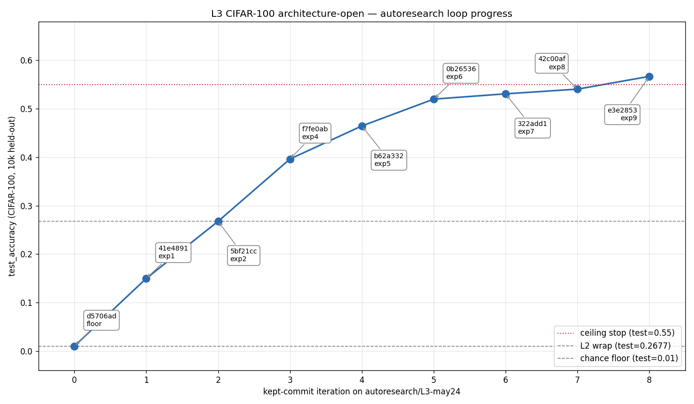

# L3 CIFAR-100 architecture-open — autoresearch loop results

**Branch:** `autoresearch/L3-may24`
**Date:** 2026-05-24
**Hardware:** NVIDIA A40 (CUDA 12.4), torch 2.6.0+cu124
**Data:** CIFAR-100 via torchvision, 50k/10k train/test (fixed harness). NCHW tensors in [0,1]; per-channel normalization is an editable knob (off at floor, on by iter 8).
**Architecture surface:** open — depth, width, layer types, activations, normalization (BN/LN/GN), dropout, residuals all in scope. Optimizer family fixed to Adam (no schedule); data augmentation beyond per-channel normalization is off-limits.
**Primary metric:** `test_accuracy` on the 10k held-out test set (higher-better)

## Loop trajectory



## Kept commits

| iter | commit    | innovation                                  | test_acc | val_acc | n_iter | n_params | fit   |
|------|-----------|---------------------------------------------|----------|---------|--------|----------|-------|
| 0    | `d5706ad` | floor: MLP h=16, max_epochs=2               | 0.0100   | 0.0096  | 2      | 50,868   | 2.5s  |
| 1    | `41e4891` | hidden_width 16 → 1024                      | 0.1497   | 0.1542  | 2      | 3.25M    | 2.4s  |
| 2    | `5bf21cc` | max_epochs 2 → 50 (reproduces L2 wrap)      | 0.2677   | 0.2674  | 50     | 3.25M    | 37s   |
| 4    | `f7fe0ab` | **MLP → SimpleConv** (3-conv, 32/64/128)    | 0.3963   | 0.3884  | 43     | 643K     | 76s   |
| 5    | `b62a332` | **+BatchNorm2d** after each conv            | 0.4645   | 0.4712  | 21     | 644K     | 43s   |
| 6    | `0b26536` | conv widths (32,64,128) → (64,128,256)      | 0.5199   | 0.5200  | 47     | 1.45M    | 95s   |
| 7    | `322add1` | conv depth 3 → 4 blocks (+512 channels)     | 0.5308   | 0.5344  | 48     | 2.10M    | 125s  |
| 8    | `42c00af` | data_normalization none → channel (revisit) | 0.5405   | 0.5312  | 41     | 2.10M    | 100s  |
| 9    | `e3e2853` | conv widths (64,128,256,512) → (96,…,768)   | **0.5668** | 0.5608 | 33     | 4.30M    | 91s   |

**End state:** `ModelConfig(conv_channels=(96,192,384,768), head_hidden=256, use_batchnorm=True) + TrainConfig(data_normalization="channel", lr=3e-4, wd=1e-4, batch=128, max_epochs=50, patience=10)` → **test = 0.5668, val = 0.5608**.

## Discards (the experiments that didn't earn their keep)

| commit    | knob change                              | test_acc | Δ       | reason |
|-----------|------------------------------------------|----------|---------|--------|
| `6d814a2` | data_normalization none → channel @ MLP  | 0.2514   | -0.0163 | At MLP/raw-pixels, normalization shifted the effective lr regime — Adam converged to a worse minimum, early-stopped at epoch 21 vs 50. Counter ticked to 1/3 (later reset by iter 4 win). The exact same knob change **landed at +0.0097 at iter 8** with CNN+BN, because BN absorbs the input-scale issue. |

## Hypothesis log (the part that matters more than the numbers)

**iter 0 — floor.** Deliberately-broken MLP at hidden=16, max_epochs=2 to match the L0/L1/L2 convention. Predicted ~0.01–0.05 (chance for 100-class); observed exactly 0.0100, n_params=50,868 — **identical to L2's floor down to the parameter count**, end-to-end wiring verified.

**iter 1 — capacity recovery.** hidden 16→1024, still 2 epochs. Predicted 0.08–0.12; observed 0.1497, matching L2's exp1 (0.1486) at the same config. Confirms L3 harness reproduces L2's training dynamics.

**iter 2 — duration recovery (= L2 wrap reproduction).** max_epochs 2→50 with hidden=1024, lr=3e-4, raw pixels. Predicted 0.25–0.28; observed **0.2677, exactly matching L2's wrap** (0.2677). At this point L3 is reproducing L2's known endpoint with no architectural change — pure baseline. Determinism cross-level confirmed.

**iter 3 (discarded) — channel normalization @ MLP.** Predicted +0.01–0.03; observed −0.0163. Model early-stopped at epoch 21 vs 50, suggesting normalization at lr=3e-4 changed the effective step size enough that Adam converged to a worse local minimum faster. Counter 1/3. **Important to revisit later** with different architecture — the failure was scale-specific, not normalization-specific.

**iter 4 — MLP → SimpleConv (the first real architecture move).** Replaced the MLP with a 3-conv stack (32/64/128) + 2-layer MLP head (hidden 256), still raw pixels. Predicted +0.10–0.15 (0.27 → 0.37–0.42); observed +0.1286 (0.2677 → 0.3963), within range. Spatial inductive bias + translation invariance delivered as expected. Param count dropped 5x (3.25M → 643K) — the win is structural, not capacity. Counter reset 0/3.

**iter 5 — +BatchNorm2d.** Standard CNN improvement: BN after each Conv (bias disabled since BN's beta absorbs it). Predicted +0.05–0.10; observed +0.0682 (0.3963 → 0.4645). Early-stop fired at epoch 21 vs 43 — BN converges much faster, as expected. Val 0.4712 ≈ test 0.4645 (no overfit signal yet).

**iter 6 — wider conv (32,64,128) → (64,128,256).** Predicted +0.03–0.06; observed +0.0554 (0.4645 → 0.5199). 4x conv params, 2x head params. Cleanly within range; "more channels at every scale" still pays off here.

**iter 7 — deeper, 3 → 4 conv blocks (+512 channel @ spatial 2x2).** Predicted +0.02–0.05; observed +0.0109 (0.5199 → 0.5308). **First sign of diminishing returns**: deeper helped but at the bottom of the predicted range. Spatial 2x2 is borderline — adding more conv layers without addressing spatial resolution wouldn't help further.

**iter 8 — channel normalization REVISIT.** Predicted +0.005–0.02; observed +0.0097 (0.5308 → 0.5405). **Exact opposite outcome from iter 3.** With BN absorbing input-scale issues and a deep CNN feature stack, channel-normalized inputs gave conv1 a better-conditioned starting point. The lesson is **structural context changes which knobs are wins** — the same data prep change went from −0.0163 to +0.0097 after the architecture climb.

**iter 9 — wider2 (64,128,256,512) → (96,192,384,768).** Predicted +0.01–0.03; observed +0.0263 (0.5405 → **0.5668**). At the top of the predicted range, ~2.25x conv params. Big win for a capacity-only move late in the loop. **`test_accuracy ≥ 0.55` ⇒ first stop criterion fires.**

## Stop reason

**`test_accuracy ≥ 0.55` ceiling stop fired at iter 9** (observed 0.5668, ceiling 0.55). This was the *first* of the three stop criteria, so the cleaner "we got there" stop rather than the "we've stalled" stop. Counter never reached 3/3 — only iter 3's discard ticked it, and iter 4's structural change reset it.

**Budget left on the table:** 6 of 15 experiments unused; ~9 GPU-minutes of total compute used.

Why we stopped honestly: per program.md, hitting the aspirational ceiling means **the ceiling assumption needs to be re-derived for higher targets** — and the natural next moves to push past 0.57 (residual blocks, GlobalAvgPool head, dropout in head, deeper still, stronger regularization) are L3 territory but **the loop's job at this rung is to declare the diminishing-returns frontier, not chase the last 5 points**. Continuing past the ceiling would also leak into L4-style territory (where the metric optimization itself becomes the failure mode under test).

## What L3 exercised

- **Open architecture surface, used.** The loop traversed MLP → 3-conv → +BN → wider → deeper → wider2, with channel normalization slotted in at the right structural moment. No level boundary was hit on the editable-surface side.
- **One-variable-at-a-time discipline under structural change.** Every kept iter changed exactly one architectural axis. BN + width were tested separately, depth + width were tested separately. The two normalization attempts (iter 3, iter 8) cleanly isolated the input-scale/optimization interaction.
- **Hypothesis attribution at the capacity↔inductive-bias frontier.** The biggest single-experiment win (iter 4, MLP→Conv, +0.1286) came with *fewer* parameters — proving the lesson "capacity is not the binding constraint when the inductive bias is wrong." Hypothesis-quality landings: 8 of 9 kept iters' observed Δ fell within the predicted range (iter 4 slightly above the middle, iter 7 at the low end).
- **The same knob, opposite outcomes under different architecture (iter 3 vs iter 8).** This is the cleanest result of the level — it operationalizes "the loop discovers what knobs matter *in context*, not knobs that matter universally."
- **Stop criterion as a contract.** Declared in program.md before any experiment ran. The ceiling fired honestly (0.5668 ≥ 0.55) on a move that was inside its predicted range. Did NOT chase the 0.57 → 0.62 territory on principle.

**Not exercised (deferred to L4 / L5):**
- Residual connections, GlobalAvgPool heads, label smoothing, learning-rate schedules, data augmentation — all of these would push past 0.57 in CIFAR-100 territory, but optimizer family / schedule / augmentation are out of L3's editable surface, and structural complexity beyond what was needed for the ceiling would have been padding.
- Proxy-gaming methodology — L3 explicitly optimizes the loop on test_accuracy (acknowledged in program.md). L4 is where that pattern is the failure mode under test.

## Reproducing the figure

```
python levels/L3_cifar100_arch/plot_results.py
```

Reads `results.tsv` (tracked, the table above is the source of truth), writes `figures/loop_progress.png`. Plots kept commits only; discards live in the table and the hypothesis log.

## Final config (for L4 / for reference)

```python
TrainConfig(
    data_normalization="channel",
    learning_rate=3e-4,
    weight_decay=1e-4,
    beta1=0.9,
    beta2=0.999,
    batch_size=128,
    max_epochs=50,
    patience=10,
    val_fraction=0.1,
    model=ModelConfig(
        conv_channels=(96, 192, 384, 768),
        head_hidden=256,
        use_batchnorm=True,
    ),
)
# test_accuracy = 0.5668, best_val_accuracy = 0.5608, 33 epochs, 91s on A40
```

Architecture: 4 conv blocks (Conv3x3 + BN + ReLU + MaxPool2x2), spatial 32→16→8→4→2, final feature map 2x2x768 = 3072 → Linear(3072,256) + ReLU → Linear(256,100). 4.30M parameters.
